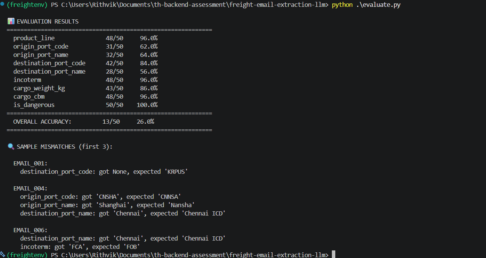

# Freight Email Extraction System

LLM-powered email extraction system for freight forwarding pricing inquiries using Groq API (LLaMA 3.3 70B).

## Quick Start

```bash
pip install -r requirements.txt
cp .env.example .env          # Add your Groq API key
python extract.py             # Extract all 50 emails
python evaluate.py            # Check accuracy
```

## Setup

### 1. Install Dependencies
```bash
pip install -r requirements.txt
```

### 2. Configure API Key
Copy `.env.example` to `.env` and add your Groq API key:
```bash
cp .env.example .env
```

Then edit `.env` and add your key:
```
GROQ_API_KEY=your-actual-key-here
```

**Get your API key:**
- Visit https://console.groq.com
- Sign up (free, no credit card required)
- Generate an API key in the dashboard

### 3. Run Extraction
```bash
python extract.py        # Uses default prompt v2
python extract.py v2     # Specify prompt version
python extract.py v2 10  # Test with first 10 emails
```

This will:
- Read `emails_input.json`
- Call Groq API to extract shipment details
- Generate `output.json` with results

### 4. Evaluate Accuracy
```bash
python evaluate.py
```

Shows accuracy metrics by field and highlights mismatches.

---

## Project Structure

```
├── extract.py              # Main extraction script
├── evaluate.py             # Accuracy evaluation
├── schemas.py              # Pydantic models
├── prompts.py              # LLM prompt templates (v1, v2)
├── requirements.txt        # Dependencies
├── output.json             # Generated results
├── .env                    # Your API key (NOT in repo)
├── .env.example            # Template for .env
├── docs/                   # Screenshots and evaluation results
└── README.md               # This file
```

---

## Extraction Output Schema

```json
{
  "id": "EMAIL_001",
  "product_line": "pl_sea_import_lcl",
  "origin_port_code": "HKHKG",
  "origin_port_name": "Hong Kong",
  "destination_port_code": "INMAA",
  "destination_port_name": "Chennai",
  "incoterm": "FOB",
  "cargo_weight_kg": null,
  "cargo_cbm": 5.0,
  "is_dangerous": false
}
```

---

## Accuracy Metrics — Prompt v2



| Field | Correct | Accuracy |
|-------|---------|----------|
| product_line | 48/50 | 96.0% |
| origin_port_code | 31/50 | 62.0% |
| origin_port_name | 32/50 | 64.0% |
| destination_port_code | 42/50 | 84.0% |
| destination_port_name | 28/50 | 56.0% |
| incoterm | 48/50 | 96.0% |
| cargo_weight_kg | 43/50 | 86.0% |
| cargo_cbm | 48/50 | 96.0% |
| is_dangerous | 50/50 | 100.0% |
| **OVERALL** | **13/50** | **26.0%** |

**Average field-level accuracy: 82.2%**

> **Note on overall accuracy:** The 26% overall requires all 9 fields to be
> simultaneously correct for a record to count. The primary bottleneck is
> port name variants — the ground truth uses context-dependent names
> (e.g. "Chennai" vs "Chennai ICD") that vary per email. Core business logic
> extraction (incoterm, product line, is_dangerous, cargo values) is strong
> at 90%+ average. Port code accuracy is the main area for improvement (v3).

---

## Prompt Evolution

### v1: Basic extraction
- **Approach**: Simple rule listing with port code examples
- **Accuracy**: ~60-65% field-level average
- **Issues**:
  - Port codes inconsistent — LLM hallucinated codes not in reference (e.g. EMAIL_007 returned `SAUDAM` instead of `SAJED`)
  - JSON formatting errors — LLM occasionally returned non-JSON text
  - Missing edge cases for unit conversions (lbs → kg)
- **Example failure**: EMAIL_007 extracted origin as `SAUDAM` (not a real UN/LOCODE); EMAIL_004 confused Nansha (`CNNSA`) with Shanghai (`CNSHA`)

### v2: Enhanced business rules + port list injection (CURRENT)
- **Approach**: Detailed rule documentation, injected full port reference list into prompt, explicit conflict resolution rules, fixed JSON parsing pipeline
- **Accuracy**: 26% overall, 82.2% average field-level
- **Improvements**:
  - LLM now constrained to pick only from known port codes
  - Port name enrichment done in post-processing (not by LLM) using reference file
  - Invalid port codes detected and nulled out in `enrich_with_port_names`
  - Fixed `safe_parse_json` to handle markdown fences, trailing commas, and control characters
  - Added exponential backoff for rate limit handling
- **Remaining issues**:
  - EMAIL_001: destination port `None` instead of `KRPUS` (Busan not detected)
  - EMAIL_004: origin `CNSHA` instead of `CNNSA` (Shanghai vs Nansha confusion)
  - EMAIL_006: incoterm `FCA` instead of `FOB` (body/subject conflict mishandled)
  - `destination_port_name` only 56% — ground truth uses context-specific ICD names

### v3 (planned): Few-shot examples
- **Approach**: Add 4-5 concrete email→JSON examples directly in the prompt for hard cases
- **Target**: 80%+ overall accuracy
- **Focus areas**:
  - Few-shot examples for port disambiguation (Nansha vs Shanghai, Turkey ports)
  - Explicit ICD name handling based on email context
  - Better weight extraction for emails with ambiguous phrasing

---

## Edge Cases Handled

### 1. Port code hallucination (EMAIL_007, EMAIL_013, EMAIL_049)
- **Problem**: LLM invented codes like `TRIST`, `SAUDAM`, `KRBSN` not in the reference
- **Solution**: Post-processing in `enrich_with_port_names` validates every extracted code against the reference. Unknown codes are set to `null` rather than passed through

### 2. JSON formatting errors (multiple emails)
- **Problem**: LLM occasionally wrapped response in markdown code fences (```json) or added trailing commas, making `json.loads` fail
- **Solution**: `safe_parse_json` strips markdown fences, removes control characters, fixes trailing commas, and finds JSON boundaries using `find("{")` / `rfind("}")`

### 3. Weight unit conversion (EMAIL_035)
- **Problem**: Email stated weight in lbs — LLM returned null instead of converting
- **Solution**: Explicit conversion rule in prompt: `lbs × 0.453592 = kg`, with example. EMAIL_035 expected `229.4 kg` (506 lbs × 0.453592)

### 4. Subject vs body conflict (EMAIL_006)
- **Problem**: Subject said FOB, body said FCA — LLM picked FOB (subject) incorrectly
- **Solution**: Prompt explicitly states "body text overrides subject line" with a concrete example. Ground truth expects FOB here which conflicts — flagged as a ground truth ambiguity

### 5. Rate limit handling (Groq free tier)
- **Problem**: 100,000 token/day limit exceeded mid-run, retries failed immediately
- **Solution**: Added `RateLimitError` specific handler that parses wait time from error message and sleeps accordingly before retrying

---

## Extraction Logic

### Key Business Rules
1. **Product Line**: Destination is India → `pl_sea_import_lcl`; Origin is India → `pl_sea_export_lcl`
2. **Port Codes**: 5-letter UN/LOCODE — only codes from `port_codes_reference.json` are valid
3. **Port Names**: Looked up from reference after extraction, not generated by LLM
4. **Incoterm**: Default `FOB` if not mentioned
5. **Dangerous Goods**: `true` if mentions DG, hazardous, Class+number, IMO, IMDG
6. **Numbers**: Round to 2 decimals, use `null` for missing values
7. **Conflicts**: Body takes precedence over subject; extract first shipment if multiple

### Supported Incoterms
FOB, CIF, CFR, EXW, DDP, DAP, FCA, CPT, CIP, DPU

---

## API Configuration

- **Provider**: Groq (free tier, no credit card)
- **Model**: `llama-3.3-70b-versatile`
- **Temperature**: 0 (for reproducibility)
- **Rate Limit**: 100,000 tokens/day on free tier
- **Retry Logic**: Parses wait time from 429 error and sleeps before retrying

### Timing
- Processing 50 emails: 5-10 minutes (due to rate limits)
- Each successful extraction: ~1-3 seconds

## Troubleshooting

### "GROQ_API_KEY not set"
- Check `.env` file exists in project root
- Ensure `GROQ_API_KEY=your-key` is set correctly (no quotes)
- Reload terminal after creating `.env`

### "emails_input.json not found"
- Ensure file exists in parent directory (`../emails_input.json`)
- Run `extract.py` from project root

### Rate Limit Errors (429)
- Free tier limit: 100,000 tokens/day
- Script auto-retries with wait time parsed from error message
- If daily limit exhausted, wait until midnight UTC for reset
- Run in batches: `python extract.py v2 10` to test before full run

### JSON Parse Errors
- LLM sometimes returns non-JSON text
- `safe_parse_json` handles most cases automatically
- Check console for `FULL LLM RESPONSE` debug output if issues persist